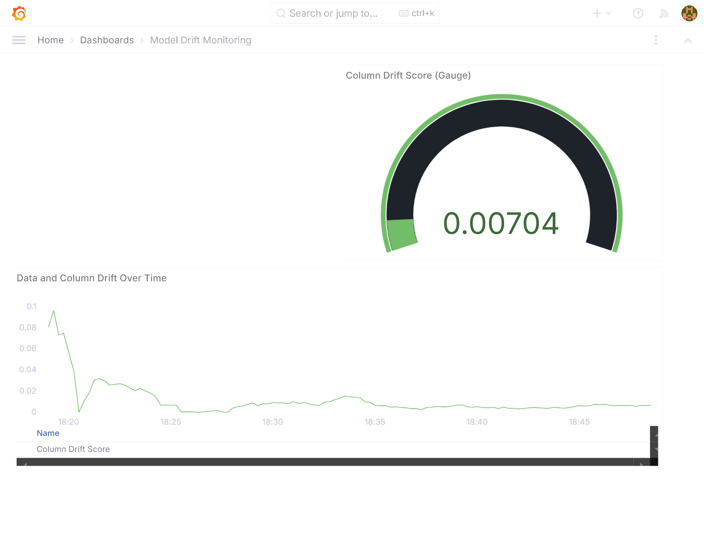

# Name-Based Gender Classification Project

## Project Overview

This project aims to classify the gender of individuals based on their Spanish names using a Long Short-Term Memory (LSTM) neural network. This model is particularly useful for filling in missing gender information in large customer databases, such as those of a mall's customer database. By accurately predicting the gender from names, businesses can enhance their data quality and make more informed decisions based on gender-related insights.

## Problem Explanation

### Context

In many customer databases, gender information might be missing or incomplete. This can hinder demographic analysis, personalized marketing, and other business strategies that rely on gender-specific data. For instance, a mall's customer database may have numerous records where the gender of the customers is not specified. 

### Objective

The objective of this project is to develop a machine learning model that can predict the gender of a person based on their first name. The model leverages a dataset of Spanish names and their corresponding genders to train an LSTM neural network. Once trained, the model can be used to infer the gender of customers whose gender information is missing, thereby enriching the dataset and enabling better demographic analysis.

### Long Short-Term Memory (LSTM)

LSTM is a type of recurrent neural network (RNN) that is well-suited for sequence prediction problems. Unlike traditional neural networks, LSTMs can learn and retain long-term dependencies, making them ideal for tasks where the order and context of the input data matter. In this case, LSTM is used to analyze the sequence of characters in a name and predict the corresponding gender.

### Workflow

1. **Data Preparation**: 
   - The project starts with a dataset containing Spanish names and their associated genders.
   - The data is cleaned and preprocessed using a script in the `data_cleaning` folder, resulting in training, validation, and testing datasets.

2. **Model Training**:
   - The LSTM model is trained using the prepared datasets. The training process is managed and tracked using MLflow, ensuring reproducibility and easy monitoring of model performance.

3. **Model Evaluation**:
   - After training, the model is evaluated on the validation and testing datasets to ensure it performs well and generalizes to new data.

4. **Model Deployment**:
   - The best-performing model is saved and can be used to predict the gender of new names. This is particularly useful for completing missing gender information in customer databases.

## Practical Applications

1. **Data Enrichment**:
   - Automatically fill in missing gender information in customer databases, improving data quality.

2. **Personalized Marketing**:
   - Enable more targeted marketing campaigns based on gender, increasing engagement and conversion rates.

3. **Demographic Analysis**:
   - Perform more accurate demographic analyses, helping businesses understand their customer base better and make informed strategic decisions.

## Project Structure

The project is organized into three main folders:

1. **dataset**
   - Contains six files with Spanish names and their corresponding gender. These files are used to build and validate the model.

2. **data_cleaning**
   - Contains a Python script named `prepare_dataset.py` which reads the dataset and generates four files:
     - `spanish names db - training.csv`
     - `spanish names db - validation.csv`
     - `spanish names db - testing.csv`
     - `spanish names db - post_testing.csv`
   - This script ensures the dataset is clean and properly formatted for training, validation, and testing.

3. **training**
   - Contains the `training_model.py` file which is responsible for training the LSTM model. The training process is managed and tracked using MLflow.
   - Once the training is complete, the best model is registered using the MLflow API in the `best_model.py` file. 

## Installation

### Using Conda

1. Clone the repository:
   ```bash
   git clone https://github.com/arismendyl97/classifying-gender-by-name.git
   ```

2. Navigate to the project directory:
   ```bash
   cd classifying-gender-by-name
   ```

3. Create and activate the conda environment using the `environment.yml` file:
   ```bash
   conda env create -f environment.yml
   conda activate mlopsproject
   ```

### Using Pip

1. Clone the repository:
   ```bash
   git clone https://github.com/arismendyl97/classifying-gender-by-name.git
   ```

2. Navigate to the project directory:
   ```bash
   cd classifying-gender-by-name
   ```

3. Install the required packages using `requirements.txt`:
   ```bash
   pip install -r requirements.txt
   ```

## How to Use

1. **Prepare the Dataset**
   - Navigate to the `data_cleaning` folder.
   - Run the `prepare_dataset.py` script to generate the training, validation, and testing datasets.

2. **Train the Model**
   - Navigate to the `training` folder.
   - Run the `training_model.py` script to start training the LSTM model. The training process will be logged and monitored using MLflow.

3. **Retrieve the Best Model**
   - After training, run the `best_model.py` script to retrieve and save the best-performing model using the MLflow API.

4. **Model Serving with Flask and Evidently `flow.py`**

   - The `flow.py` sets up a model serving application using Flask, MLflow, and Evidently for monitoring. The service predicts gender based on names using the LSTM model registered in MLflow and includes a data drift monitoring feature.

      - **Flask API:** Provides a REST API for predictions:
         - **`/predict`**: Accepts POST requests with a name, processes it, and returns gender predictions.
         - **`/drift_report`**: Returns a data drift report.
      - **Data Drift Monitoring:** Uses Evidently to monitor data drift, although it's not directly exposed through the API in this code.
      

      - **Multithreaded Execution:** Runs the Flask app in a separate thread to ensure non-blocking operations.
      - **Application Execution:** Uses Prefect to orchestrate the loading of the model and starting of the Flask application.


### **Installation and Running - DOCKER**

This project is Dockerized and includes all necessary Python dependencies, as well as Grafana and Prometheus for monitoring model performance. Follow these steps to set up and run the application:

1. **Build and Run the Docker Containers**

   Use Docker Compose to build and start the containers. This will install all Python dependencies and set up Grafana and Prometheus.

   ```bash
   docker-compose up --build
   ```

   This command will:

   - Build Docker images for the Flask application, Grafana, and Prometheus.
   - Start containers for each service.
   - Install Python requirements and configure the environment.

2. **Access the Application**

   - The Flask application will be accessible at `http://localhost:4500`.
   - Grafana will be available at `http://localhost:3000` (default credentials: admin/admin).
   - Prometheus will be available at `http://localhost:9090`.

3. **Monitoring**

   - **Grafana**: The Docker setup includes a basic Grafana configuration to monitor model metrics.
   - **Prometheus**: The setup includes Prometheus for collecting and storing metrics. 

   Ensure that Grafana and Prometheus are correctly configured to visualize the data from your model.

4. **Testing the Endpoint**

   Here's how you can test the endpoint:

   #### Using `curl`

   ```sh
   curl -X POST http://localhost:4500/predict \
   -H "Content-Type: application/json" \
   -d '{"name": "Luis"}'
   ```


## Requirements

- Python 3.11.9
- TensorFlow
- MLflow
- Pandas
- NumPy
- Flask
- Prometheus
- Grafana

## License

This project is licensed under the MIT License.

## Acknowledgements

Special thanks to all contributors and the open-source community for their invaluable resources and support.
